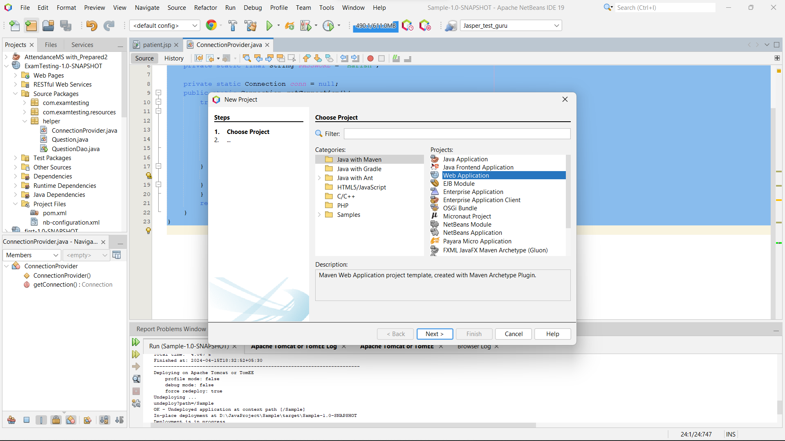
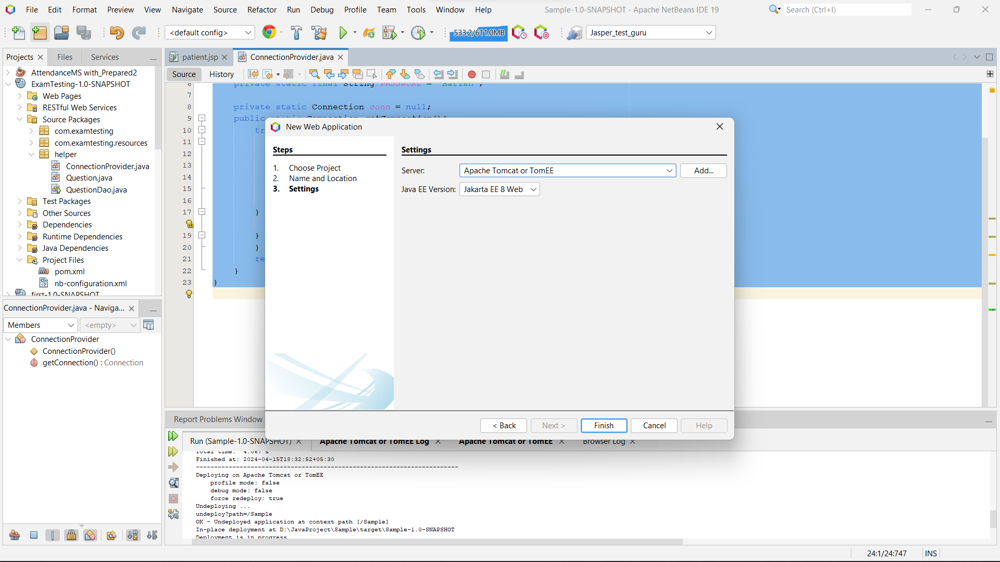
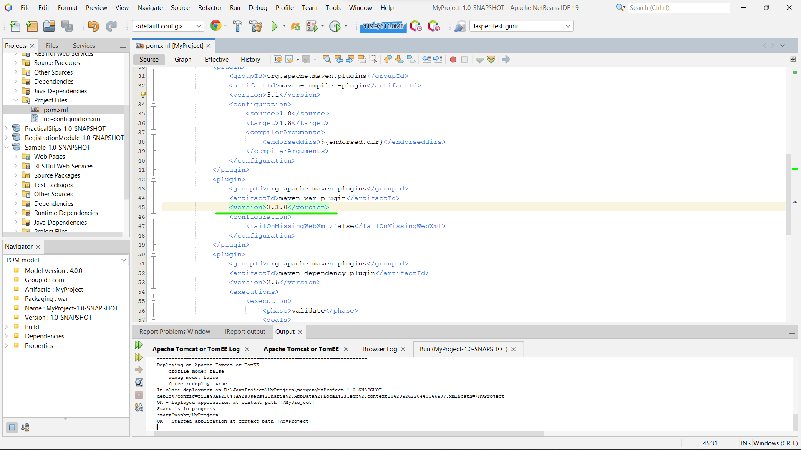
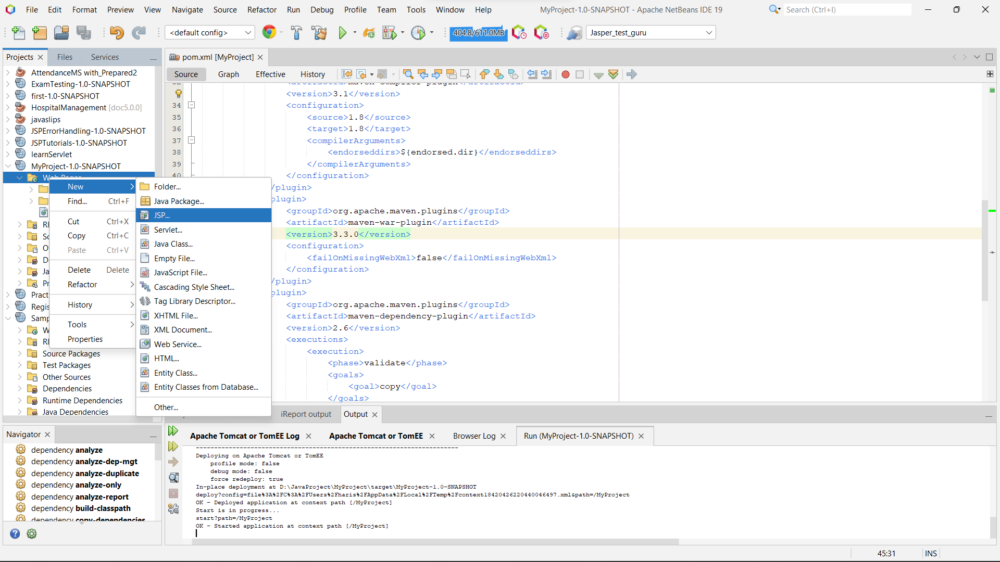

# JSP Web Project Setup Guide

This guide provides detailed instructions on how to build and run a JSP web project using NetBeans IDE. Follow the steps below to set up your environment and get started.

## Prerequisites
- Java Development Kit (JDK) installed on your system
- Apache Tomcat server
- NetBeans IDE installed on your system
- Basic understanding of Java Servlets and JSP

## Steps to Build and Run the Project

1. **Create a New Web Application Project:**
   - Open NetBeans IDE.
   - Go to `File` > `New Project`.
   - Select `Java Web` from the categories and then choose `Web Application`.
   - Click `Next`, provide a project name and location, then click `Finish`.

2. **Add JavaServer Pages (JSP) File:**
   - Right-click on the `Web Pages` folder in the project explorer.
   - Select `New` > `JSP`.
   - Provide a name for your JSP file and click `Finish`.

3. **Write Your JSP Code:**
   - Open the newly created JSP file.
   - Write your HTML and JSP code to create the desired web page content.

4. **Configure Deployment Descriptor (web.xml):**
   - Right-click on your project and select `Properties`.
   - Go to the `Web` category.
   - Configure the `Context Path` for your application.
   - Click `OK` to save the changes.

5. **Build and Deploy:**
   - Right-click on your project and select `Clean and Build`.
   - Once the build is successful, right-click on the project again and select `Run`.

6. **Access Your Web Application:**
   - Open a web browser.
   - Enter the URL: `http://localhost:8080/<context-path>/<your-jsp-file-name>.jsp`.

## Screenshots

### Step 1: Creating a New Web Application Project

### Step 2: Select the web server

### Step 3: Project Created

### Step 4: Run the project if War plugin error occurred like this

### Step 5: Updated the war plugin in pom.xml file

#### change the war plugin version to 3.3.0 like this

### Step 6: create the new jsp file

### Step 7: Accessing Web Application

Follow these steps, and you'll be able to build and run your JSP web project in NetBeans without any hassle.